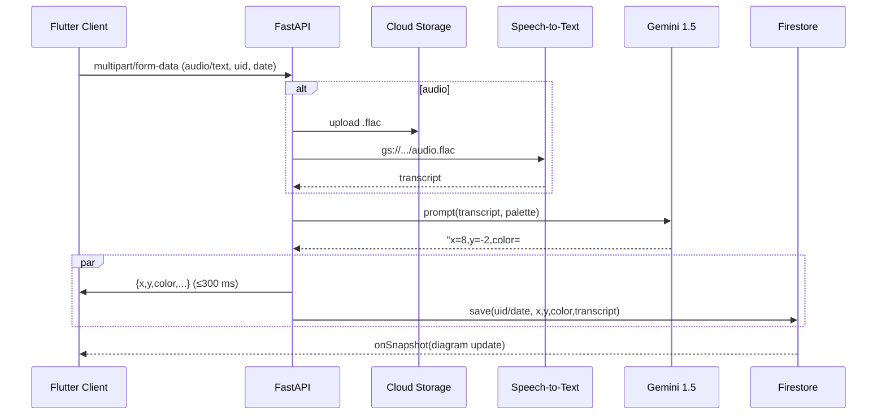
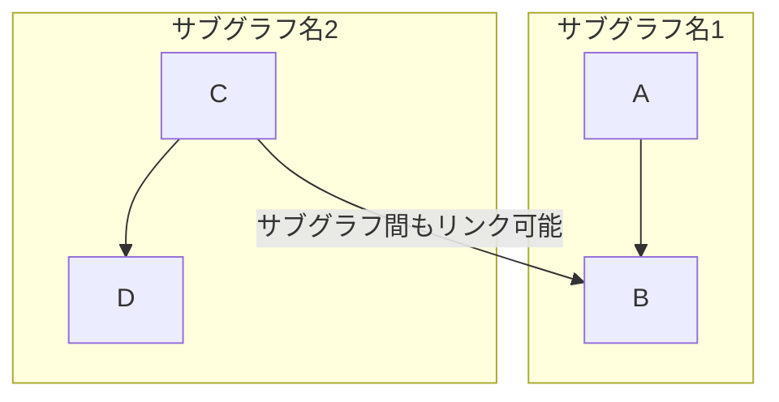

# はじめに
「忙しくて日記が続かない」「自分の感情パターンを文字ではなく、一目見てわかる形で客観視したい」  
そんな悩みを解決するために、**音声／テキスト入力 → AI 感情分析 → カラーヒートマップ**をワンタップで生成するアプリを開発しました。
本記事では作成したアプリについて深掘りしていきます。

このアプリを作る際に、参考にしたのはgithub contributionのheatmapです。
heatmapを見返したときに、仕事が忙しくて草を生やせなかったとき、個人開発や勉強に勤しんでいたときが一目で明らかにわかるので、
日記的な使い方としても楽しんでいる自分に気付いたので、そこに特化したアプリを作成したいと思ったことが開発の理由です。

```
● Python 3.12        ● FastAPI 0.110
● Vertex AI (Gemini 1.5‑flash‑002)
● Cloud Speech‑to‑Text
● Cloud Firestore / Cloud Storage
● Flutter 3.22       ● Riverpod 3
● Firebase Auth & AppCheck
● GitHub Actions + Cloud Run
```

---

## 1. アプリのユースケース
| Persona | 課題 | 既存手段の問題点 | 本アプリの価値 |
| --- | --- | --- | --- |
| 学生 T さん | レポートとアルバイトで日記を書く暇がない | 紙の日記は三日坊主、アプリ入力も手間 | **音声 10 秒 → 自動記録** |
| 社会人 K さん | 忙しくてストレス源を可視化したい | ストレスチェックは年 1 回で遅い | **日次カラーで傾向把握 → 早期対処** |
| メンタルコーチ | クライアントの感情曲線を追いたい | チャットでの報告は粒度が不揃い | **Firestore リアルタイム共有 & 分析 API** |

日記の欠点である
・書くのが面倒くさい、3日坊主になりがち
・後から見返したときに、細かい気持ちなどを見返すことはできるが、一目見て気持ちの変化等がわからない
・自分の感情の評価がしにくい
を解決できる
---

## 2. システム全体図





### レイテンシ内訳 (実測値 / Cloud Run・東京リージョン)
| ステップ | 平均 | P95 |
| --- | ---:| ---:|
| GCS アップロード(200 KB) | 90 ms | 140 ms |
| Speech‑to‑Text(10 s) | 850 ms | 1.2 s |
| Gemini 推論(♥Flash) | 110 ms | 180 ms |
| Firestore 書込 | 35 ms | 60 ms |
| **合計** | **≈1.1 s** | **≈1.6 s** |

---

## 3. 採用技術・バージョン詳細

| レイヤ | サービス / ライブラリ | v | 選定理由 |
| --- | --- | --- | --- |
| Backend | **FastAPI** | 0.110 | ASGI + `BackgroundTasks` で簡潔に非同期実装 |
| LLM | **Vertex AI Gemini 1.5‑flash‑002** | 2025‑05 | 128k token, 低レイテンシ & 従量課金 |
| 音声認識 | **Cloud Speech‑to‑Text** | GA | 日本語 diarization が安定、FLAC 対応 |
| Storage | **Cloud Storage** | multi‑reg | 音声を安価に保存、署名 URL も利用可 |
| DB | **Cloud Firestore** | Native | リアルタイムリスナー × クライアントキャッシュ |
| Mobile | **Flutter 3.22** | stable | 単一コードで iOS / Android / Web |
| 状態管理 | **Riverpod 3** | ‑ | DI とスコープが明確、テスト容易 |
| Router | **GoRouter 14** | ‑ | URL ベースの宣言的ナビゲーション |
| Auth | **Firebase Auth** | GA | Email + Google + App Check Debug |
| DevOps | **GitHub Actions** | 2025Q2 | ビルド → コンテナ push → Cloud Run deploy |
| Observability | **Cloud Logging / Error Reporting** | ‑ | Python の `logging.exception` を集約 |

---

## 4. API インタフェース

### 4.1 `/diary/audio` POST

| Field | Type | Req | Description |
| --- | --- | --- | --- |
| `uid` | string | ✔︎ | Firebase UID |
| `date` | string | ✔︎ | `YYYY-MM-DD` |
| `audio` | file | ✔︎ | FLAC / 44.1 kHz 推奨 |

**200 OK**

```json
{
  "x": 8,
  "y": -2,
  "color": "#FFC1CC",
  "transcript": "今日は研究発表がうまく行った！"
}
```

**エラー設計**

| Status | 例 | ハンドリング |
| --- | --- | --- |
| 400 | 拡張子不正 | Flutter 側で SnackBar |
| 413 | >10 MB | 録音長を 3 min に制限 |
| 500 | Vertex / STT 障害 | リトライ (指数バックオフ) |

### 4.2 `/diary/text` POST
同パラメータで `text` フィールドを送信。  
レスポンスは `transcript` を含まない。

---

## 5. 色推論ロジック深掘り

```mermaid
graph TD
  A[4‑Quadrant Palette<br>(bright/energetic/dark/calm)]
  B[x: -10~+10]
  C[y: -10~+10]
  D(|x| : |y| で重み)
  E[線形補間<br>RGBA = Σ wᵢ·cᵢ]
  A --> D
  B --> D
  C --> D
  D --> E
```

### 5.1 Gemini プロンプト要点
- **1 行出力**のみ許可 → `re.match()` で厳格パース
- `|x| : |y|` 比で 2 色ブレンド → *色を連続空間に落とし込む*
- 出力バリデーションで範囲外なら `clamp(-10,10)`

### 5.2 Flutter 側補間アルゴリズム

```dart
double _norm(double v) => (v + 10) / 20; // -10~10 → 0~1
final wNE = nx * ny;           // energetic
final wNW = (1-nx) * ny;       // bright
final wSW = (1-nx)*(1-ny);     // calm
final wSE = nx*(1-ny);         // dark
```

RGBA を独立に線形合成することで**2D バイリニア補間**と同等の滑らかさを実現します。  
ブライトネスや α を使わず「心理的距離 = 二次元ユークリッド距離」で可視化できる点が特色。

---

## 6. 非同期 & スケーラビリティ設計

| 要素 | 採用 | 理由 |
| --- | --- | --- |
| **I/O バウンド処理** | `async def` + `await` | STT / GCS / Firestore はネットワーク待ちが支配的 |
| **CPU バウンド処理** | `asyncio.to_thread()` | Pillow 等で WAV→FLAC 変換する場合を想定 |
| **並列度** | Cloud Run **min‑instance=0 / max‑instance=10** | 1 リクエスト ≈ 0.2 vCPU → 理論上 ~40 RPS |
| **同時録音** | クライアント録音を 3 分以内 & 10 MB 制限 | STT sync API の上限 (60 s) を回避 |

---

## 7. モバイル実装 Tips

| 課題 | 解決コード | コメント |
| --- | --- | --- |
| **認証状態でリダイレクト** | `GoRouterRefreshStream(FirebaseAuth.instance.authStateChanges())` | Riverpod の `ChangeNotifier` として利用 |
| **App Check Debug** | `FirebaseAppCheck.instance.activate(androidProvider: AndroidProvider.debug)` | β テストでリジェクトされない |
| **録音権限** | `AudioRecorder.hasPermission()` | iOS の *Info.plist* も忘れず |
| **色盲対策** | `ColorSetupPage` でユーザが色を自由選択 | WCAG Ratio > 4.5 に誘導予定 |

---

## 8. CI/CD & IaC

```yaml
# .github/workflows/deploy.yml
jobs:
  build:
    steps:
      - uses: actions/checkout@v4
      - uses: google-github-actions/setup-gcloud@v2
        with:
          project_id: ${{ secrets.GCP_PROJECT }}
      - run: gcloud builds submit --tag=us-central1-docker.pkg.dev/$PROJECT/api:$GITHUB_SHA
      - run: gcloud run deploy verbal-detox-api \
              --image=us-central1-docker.pkg.dev/$PROJECT/api:$GITHUB_SHA \
              --platform=managed --region=us-central1 \
              --allow-unauthenticated --quiet
```

- **infra-as-code** は Terraform で Cloud Run / Firestore ルール / IAM を定義
- Secrets は GitHub OIDC → Workload Identity Federation で渡すため **長期キー 0 本**

---

## 9. ランニングコスト概算 (2025‑05, 東京リージョン)

| サービス | 単価 | 月間利用 (例) | 金額 |
| --- | --- | ---:| ---:|
| Cloud Run | 0.000012 $/vCPU‑s | 50 k req × 0.3 s | **0.18 $** |
| Speech‑to‑Text | 0.006 $/min | 1 k 分 | **6.00 $** |
| Gemini Flash | 0.000125 $/1k tokens | 50 k req × 0.5k T | **3.13 $** |
| Storage | 0.026 $/GB | 5 GB | **0.13 $** |
| Firestore | 無料枠内 | – | 0 $ |
| **合計** | — | — | **≈9.4 $/月** |

**先着 90 Days 無料枠**（Speech 60 min/⽇、Vertex 60 min/⽇）を利用すれば MVP はほぼゼロ円で回せます。

---

## 10. セキュリティ / プライバシー

- **認証トークン検証**：Cloud Run *Audience* = Firebase プロジェクト
- **STT / Gemini** には個人名を含むデータを送らない設計
- **CORS**：`allow_origin: https://*.web.app` のみ
- **Firestore ルール**：
  ```firestore
  match /users/{uid}/diary/{docId} {
    allow read, write: if request.auth.uid == uid;
  }
  ```
- **ボイスデータ自動削除**：Lifecycle で 30 日後に削除

---

## 11. 今後の展望

| Roadmap | 内容 |
| --- | --- |
| ✅ P0 | 音声 / テキスト入力, ヒートマップ |
| 🔄 P1 | **週次レポート PDF** を Cloud Functions で生成 |
| 🔄 P2 | **睡眠ログ / 歩数** を Google Fit 連携し相関分析 |
| 💤 P3 | 心拍変動 (HRV) センサーとの統合 |

---

## まとめ

- **非同期 FastAPI + Gemini Flash** で 1 s 以内の感情分析を実現  
- **Flutter** のバイリニア補間で “あなた色” の感情ヒートマップを表現  
- MVP コストは **月 10 $ 未満**、無料枠も活用可能  

「日記が続かない」を **“声でサクッと”** 解決し、あなたの心の変化を **“色でパッと”** 可視化する――本記事が実装のヒントになれば幸いです。  

🚀 **Try it, and paint your days!**
