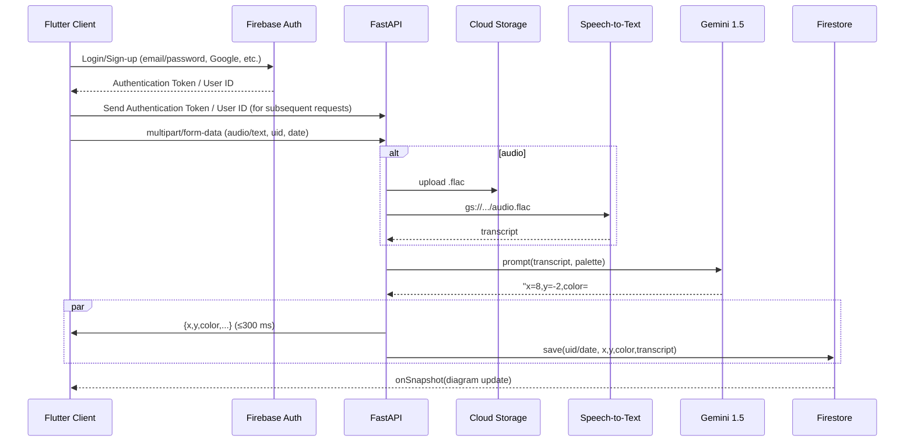
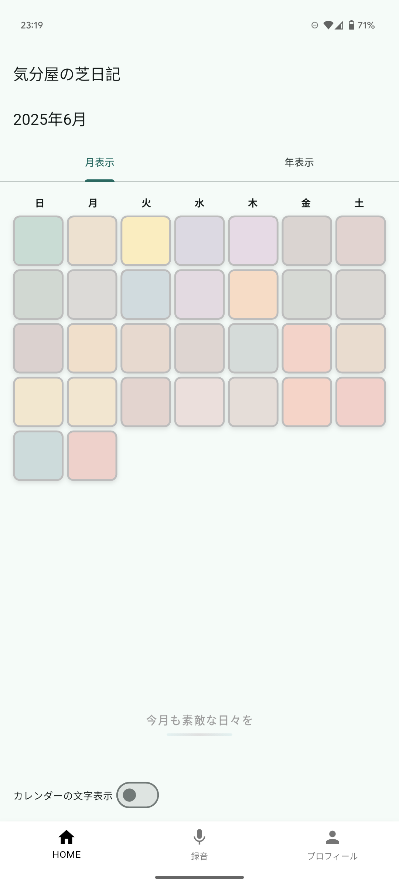
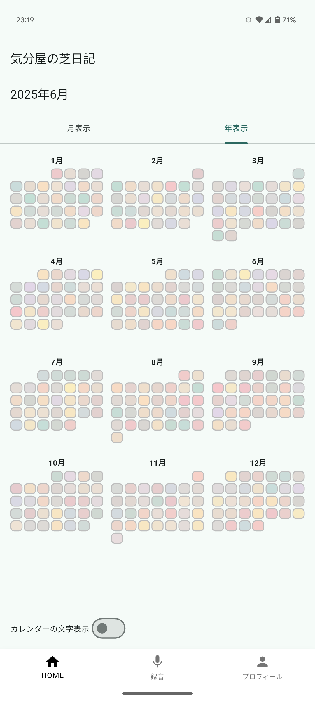
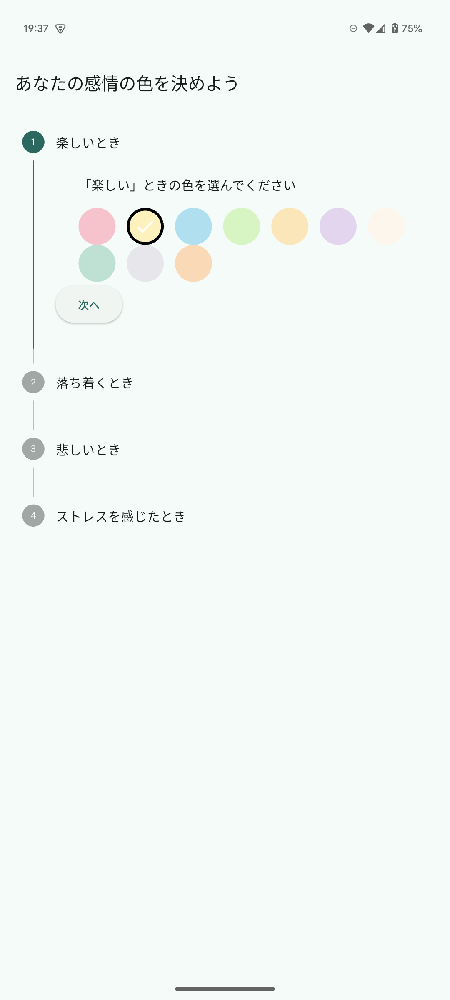
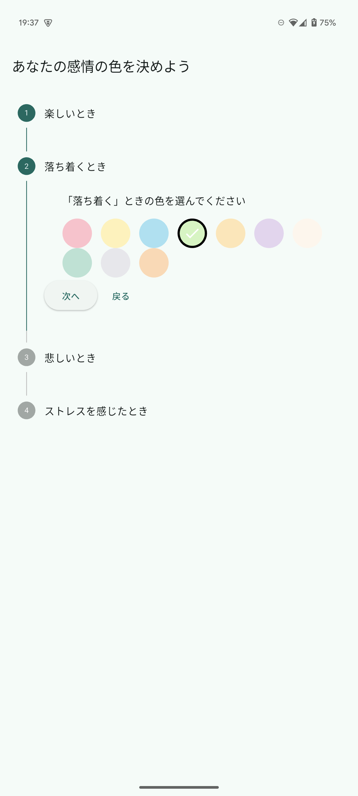
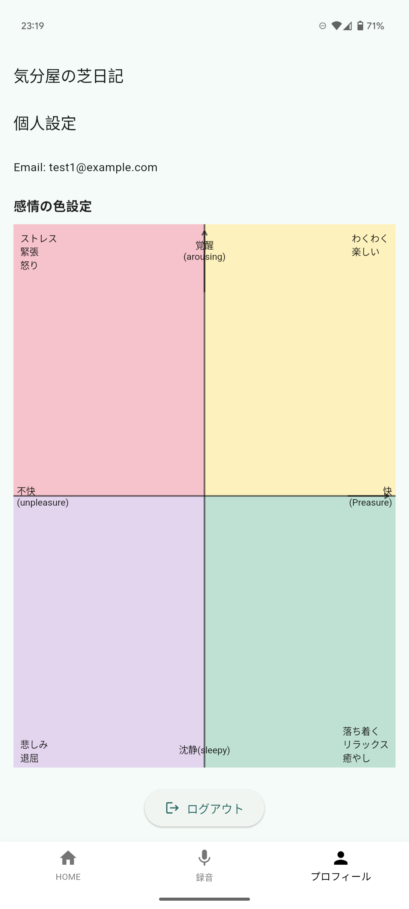

# はじめに
「忙しくて日記が続かない」「タイピングや手帳に書くのが面倒くさい」
「自分の出来事を文字ではなく、一目見てわかる形で客観視したい」  
そんな悩みを解決するために、**音声入力 → AI 感情分析 → カラーヒートマップ**を生成するアプリを開発しました。

このアプリを作る際に参考にしたのは、github contributionのheatmapです。
GitHubで日々草を生やしているうちに、Heatmapを振り返ることで、仕事が忙しくて草が生やせなかった時期や、個人開発や勉強に集中していた時期が一目でわかることに気付きました。それがまるで日記のようで、自分にとって楽しい記録になっているのだと感じました。
この体験から、GitHubを使っていない人でも、色だけで構成されたカレンダーを眺めることで、自分の過去を思い出し、楽しめるようなアプリを作りたいと思ったのが、開発のきっかけです。
アプリ名は、google geminiに名付けてもらい、"感情"・"gihubの草を生やす"・"日記"からイメージされた？「気分屋の芝日記」となりました。

## 対象とするユーザー層
- 忙しい社会人・学生 — まとまった入力時間を確保しにくい
- ライティングが苦手／スマホ入力が遅い人 — 音声入力なら心理的ハードルが低い
- 子育て・介護中のユーザー — 両手がふさがっていても記録できる
- カウンセリングやコーチングを受けているクライアント — 日々の感情を手軽に記録し、セルフケアに役立てたい。あるいは客観的な感情の変化を共有したい

## ユーザーが抱える具体的課題
- 入力のハードルが高い — キーボード入力、フリック入力や手書きはまとまった時間や場所を要し、継続が難しい
- 継続モチベーションの低下 — 成果が視覚化されないと達成感が得にくく、習慣化しづらい
- 感情の一目把握が困難 — 長文が蓄積するだけでは気分の傾向が見えない
- 主観に偏った振り返り — 自己評価のみでは感情を過小・過大評価しがち

## 課題へのソリューションと特徴
- 音声入力で録音ボタンを押すだけで記録開始。忙しいシーンでも即座にメモができます。
- Gemini による感情スコアリング & カラーヒートマップラッセルの円環モデル（快／不快 × 覚醒／沈静）に沿って (x, y) 座標を算出し、ユーザーが設定したパレットで色を決定。
　GitHub風のヒートマップUIに反映し、月・年単位で一目で気分の波を把握できます。
- 促進ヒートマップの空白（未登録日）がひと目で分かるため、自然と「今日も記録しよう」という気持ちが湧き、継続率を向上。
- カスタムパレットで各象限の色を自由に設定可能。好みの色味や見やすいコントラストを選んで自分らしいダイアリーにできます。また、特定の見えにくい色があるユーザーでも楽しめるように意識しています。

## 主要な機能
- ログイン機能
- 1月毎、1年(12月)毎のカレンダー表示
- 音声入力で日記を記録
- 感情に合わせた色の個人設定
- 記録した音声をAIが感情分析し、設定した色に合わせて混色・記録
- 感情分析において、ラッセルの円環モデルに基づいて、X軸を快(+)・不快(-)、Y軸を覚醒(+)・沈静(-)とし、
　第一象限：わくわく、楽しい
　第二象限：ストレス、緊張、怒り
　第三象限：悲しみ、退屈
　第四象限：落ち着く、リラックス、癒し
　と設定

## システムアーキテクチャ
| レイヤ | サービス / ライブラリ |
| --- | --- |
| Backend | **FastAPI** |
| LLM | **Vertex AI Gemini 1.5‑flash‑002** |
| 音声認識 | **Cloud Speech‑to‑Text** |
| Storage | **Cloud Storage** |
| DB | **Cloud Firestore** |
| Mobile | **Flutter 3.22** |
| 状態管理 | **Riverpod 3** |
| Router | **GoRouter 14** |
| Auth | **Firebase Auth** |
| Observability | **Cloud Logging / Error Reporting** |

## 4 .全体フロー

1. **ユーザー認証（Firebase Authentication）**
   * ユーザーはアプリでログインまたは新規登録
   * Firebase Authenticationが認証情報（メール/パスワード、Googleアカウントなど）を検証し、認証トークンとユーザーIDをクライアントに返す
2. **ユーザー操作**
   * 音声録音を開始／停止
3. **クライアント → API**
   * 音声分析: `POST /diary/audio` に認証トークン、`uid`, `date`, `audio` ファイルを multipart で送信
4. **FastAPI サーバー（Cloud Run）受信**
   * リクエストを受け取り、認証トークンの検証、パラメータ／ファイルを取得
5. **音声 → 文字起こし**（音声送信時）
   * Google Cloud Speech-to-Text API でバイト列を文字化
6. **感情解析 & 配色生成**
   * 文字列を Vertex AI（Gemini）に投げ、
   * レスポンスから (x, y) 座標とカラーコードをパース
7. **Firestore 書き込み**
   * `BackgroundTasks` で非同期にドキュメントを保存
   * ドキュメントID: `{uid}_{date}`
8. **API → クライアント**
   * JSON レスポンスで `x`, `y`, `color` を返却
9. **クライアント表示**
   * 受け取ったカラーを UI に反映、ユーザーが結果を確認

以上が、音声対応の感情解析アプリにおける処理概要です。

### 5 Gemini プロンプト要点
- 色のブレンドは、Geminiを利用(線形補完等は行わない)
- `|x| : |y|` 比で2色ブレンドし、色を連続空間に落とし込む

## デモ画面

#### HOME画面(今月のカレンダー)

#### HOME画面(今年のカレンダー)

#### 色設定画面

#### 個人設定

## デモ動画

## Githubリポジトリ
https://github.com/matcha110/cloud-verbaldetox-api

https://github.com/matcha110/verbaldetox

## 6. ランニングコスト概算

| サービス | 単価 | 月間利用 (例) | 金額 |
| --- | --- | ---:| ---:|
| Cloud Run | 0.000012 $/vCPU‑s | 50 k req × 0.3 s | **0.18 $** |
| Speech‑to‑Text | 0.006 $/min | 1 k 分 | **6.00 $** |
| Gemini Flash | 0.000125 $/1k tokens | 50 k req × 0.5k T | **3.13 $** |
| Storage | 0.026 $/GB | 5 GB | **0.13 $** |
| Firestore | 無料枠内 | – | 0 $ |
| **合計** | — | — | **≈9.4 $/月** |
5000requestで約1500円程度と想定しています。

## 今後の改善予定
- デザインやUI/UXの改善
- ランニングコストの削減
- 収集した声のデータを用いて、AI学習に使用し、聞き取りの改善・補完
- 色の好みを収集して、提案する色の調整　等
