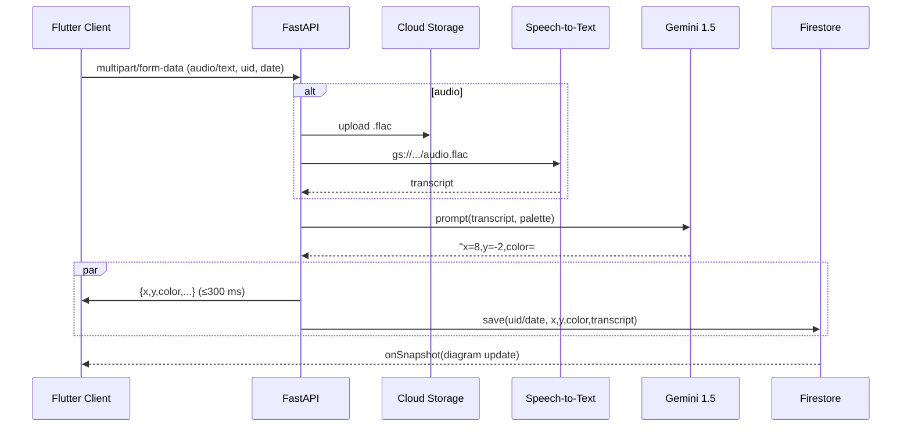

# はじめに
「忙しくて日記が続かない」「タイピングや手帳に書くのが面倒くさい」「自分の出来事を文字ではなく、一目見てわかる形で客観視したい」  
そんな悩みを解決するために、**音声入力 → AI 感情分析 → カラーヒートマップ**を生成するアプリを開発しました。

このアプリを作る際に参考にしたのは、github contributionのheatmapです。
自分がgithubで草を生やしていく中でheatmapを見返したときに、仕事が忙しくて草を生やせなかったことや個人開発や勉強に勤しんでいたときが一目で明らかにわかるので、日記的な使い方としても楽しんでいる自分に気付きました。
ただgithubを使わない人でも、同じように一目見て、過去の思い出を色だけで構成されたカレンダーを見ることで楽しめるアプリを作成したいと思ったことが開発の理由です。

## 対象とするユーザー像と課題
また、日記の欠点である
・書く、打ち込むのが面倒くさい
・後から見返したときに、ある程度読み返せば細かい気持ちなどを見返すことはできるが、一目見て気持ちの変化等がわからない
・自分の感情に対する客観的な評価がしにくい
を解決するという点も配慮しています。

## 課題へのソリューションと特徴

## 主要な機能
- ログイン機能
- 1月毎、1年(12月)毎のカレンダー表示
- 音声入力で日記を記録
- 感情に合わせた色の個人設定
- 記録した音声をAIが感情分析し、設定した色に合わせて混色・記録
- 感情分析において、ラッセルの円環モデルに基づき、X軸を快(+)・不快(-)、Y軸を覚醒(+)・沈静(-)とし、
　第一象限：わくわく、楽しい
　第二象限：ストレス、緊張、怒り
　第三象限：悲しみ、退屈
　第四象限：落ち着く、リラックス、癒し
　と設定

## システムアーキテクチャ
| レイヤ | サービス / ライブラリ | v | 選定理由 |
| --- | --- | --- | --- |
| Backend | **FastAPI** | 0.110 | ASGI + `BackgroundTasks` で簡潔に非同期実装 |
| LLM | **Vertex AI Gemini 1.5‑flash‑002** | 2025‑05 | 128k token, 低レイテンシ & 従量課金 |
| 音声認識 | **Cloud Speech‑to‑Text** | GA | 日本語 diarization が安定、FLAC 対応 |
| Storage | **Cloud Storage** | multi‑reg | 音声を安価に保存、署名 URL も利用可 |
| DB | **Cloud Firestore** | Native | リアルタイムリスナー × クライアントキャッシュ |
| Mobile | **Flutter 3.22** | stable | 単一コードで iOS / Android / Web |
| 状態管理 | **Riverpod 3** | ‑ | DI とスコープが明確、テスト容易 |
| Router | **GoRouter 14** | ‑ | URL ベースの宣言的ナビゲーション |
| Auth | **Firebase Auth** | GA | Email + Google + App Check Debug |
| DevOps | **GitHub Actions** | 2025Q2 | ビルド → コンテナ push → Cloud Run deploy |
| Observability | **Cloud Logging / Error Reporting** | ‑ | Python の `logging.exception` を集約 |

## 4 .全体フロー

1. **ユーザー操作**

   * 音声録音を開始／停止
2. **クライアント → API**

   * 音声分析: `POST /diary/audio` に `uid`, `date`, `audio` ファイルを multipart で送信
3. **FastAPI サーバー（Cloud Run）受信**

   * リクエストを受け取り、パラメータ／ファイルを取得
4. **音声 → 文字起こし**（音声送信時）

   * Google Cloud Speech-to-Text API でバイト列を文字化
5. **感情解析 & 配色生成**

   * 文字列を Vertex AI（Gemini）に投げ、
   * レスポンスから (x, y) 座標とカラーコードをパース
6. **Firestore 書き込み**

   * `BackgroundTasks` で非同期にドキュメントを保存
   * ドキュメントID: `{uid}_{date}`
7. **API → クライアント**

   * JSON レスポンスで `x`, `y`, `color` を返却
8. **クライアント表示**

   * 受け取ったカラーを UI に反映、ユーザーが結果を確認

## テキスト結果の編集フロー

1. ユーザーが解析結果テキストを編集
2. 修正テキストを別エンドポイント（例: `POST /diary/text`）に送信
3. API で再解析し、Firestore ドキュメントを更新
4. 更新済み結果をクライアントに返却

以上が、音声対応の感情解析アプリにおける処理概要です。

### 5 Gemini プロンプト要点
- 色のブレンドは、Geminiを利用(線形補完等は行わない)
- **1 行出力**のみ許可 → `re.match()` で厳格パース
- `|x| : |y|` 比で 2 色ブレンド → *色を連続空間に落とし込む*

## デモ動画

## Githubリポジトリ

## 6. ランニングコスト概算

| サービス | 単価 | 月間利用 (例) | 金額 |
| --- | --- | ---:| ---:|
| Cloud Run | 0.000012 $/vCPU‑s | 50 k req × 0.3 s | **0.18 $** |
| Speech‑to‑Text | 0.006 $/min | 1 k 分 | **6.00 $** |
| Gemini Flash | 0.000125 $/1k tokens | 50 k req × 0.5k T | **3.13 $** |
| Storage | 0.026 $/GB | 5 GB | **0.13 $** |
| Firestore | 無料枠内 | – | 0 $ |
| **合計** | — | — | **≈9.4 $/月** |
5000requestで約1500円程度と想定しています。

## 7. セキュリティ / プライバシー

- **認証トークン検証**：Cloud Run *Audience* = Firebase プロジェクト
- **ボイスデータ自動削除**：Lifecycle で 30 日後に削除

## 今後の改善予定
- デザインやUI/UXの改善
- ランニングコストの削減
- 収集した声のデータを用いて、AI学習に使用し、聞き取りの改善・補完
- 色の好みを収集して、提案する色の調整　等
